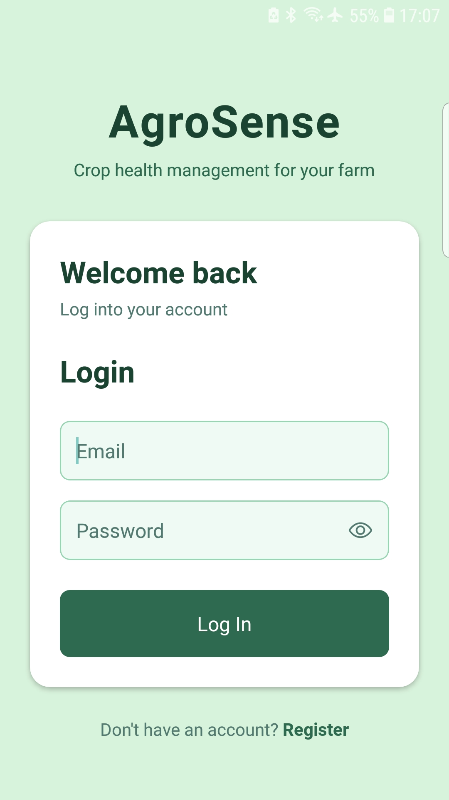
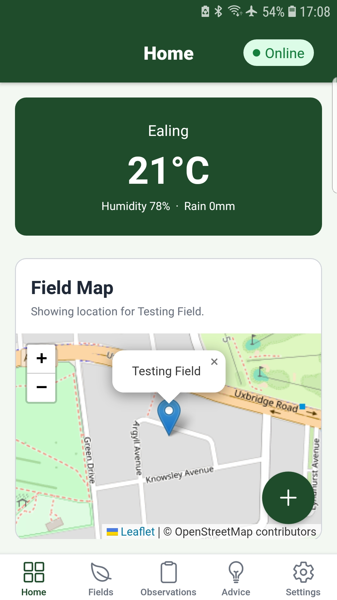
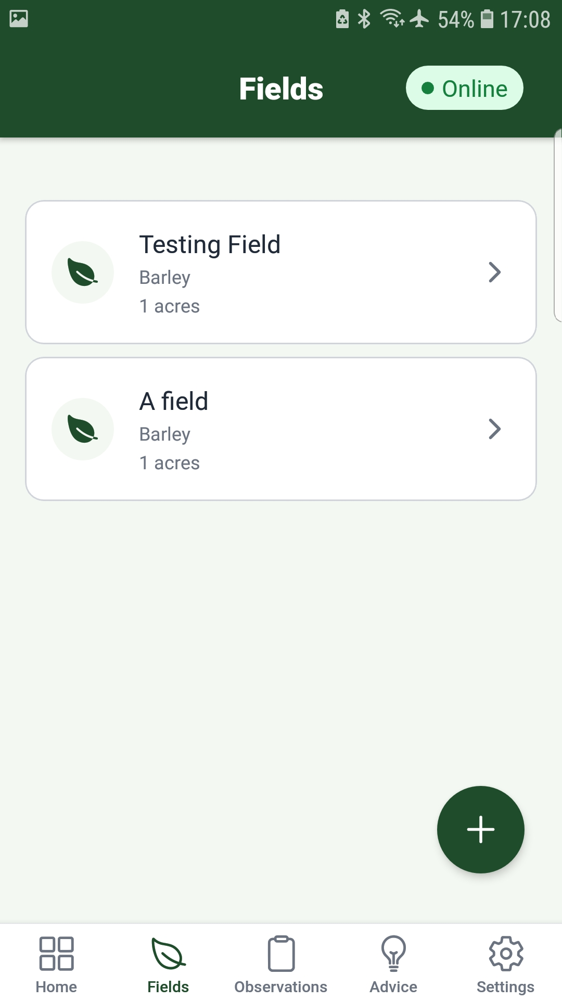
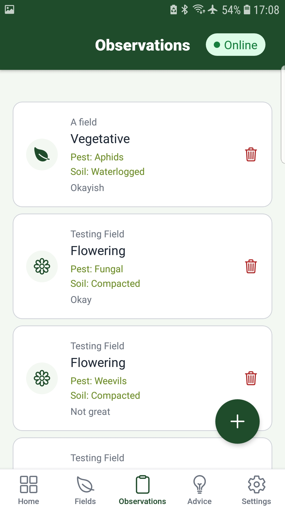
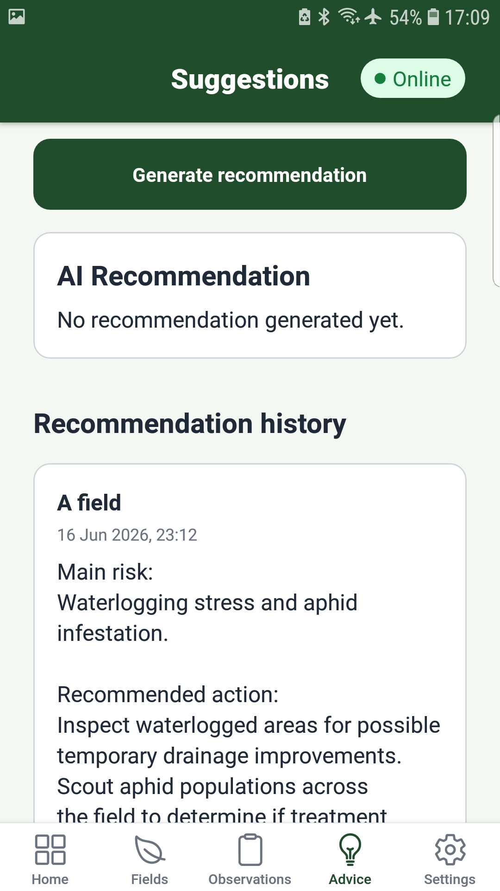
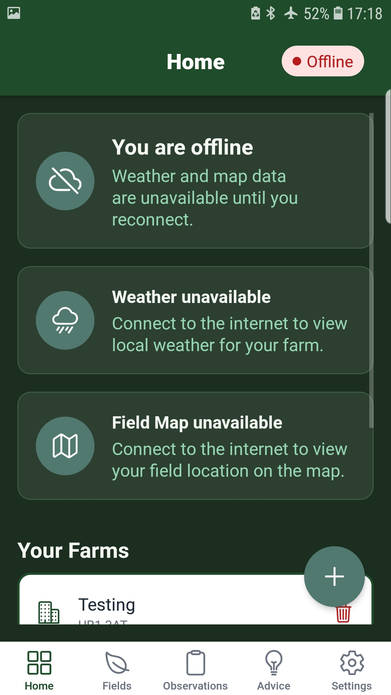

# AgroSense

> Developed as part of a multidisciplinary team project at La Fosse Academy, with contributions focused on offline-compatible functionality, Firebase integration, AI-powered recommendations, and technical documentation.

AgroSense is an AI-powered mobile agriculture platform designed to help small farms make data-driven decisions through field observations, weather insights, and intelligent recommendations.

Built using React Native, Firebase, Firestore, OpenStreetMap, Gemini AI, AsyncStorage, and REST APIs, the application enables users to continue recording observations in low-connectivity environments while automatically synchronising data when connectivity is restored.

## Technologies

### Frontend

- React Native
- Expo
- JavaScript

### Backend & Database

- Firebase Authentication
- Firestore
- AsyncStorage

### APIs & Integrations

- Gemini AI
- Open-Meteo Weather API
- OpenStreetMap
- Postcodes.io API

### Development

- Git
- GitHub
- Agile Methodologies

## Key Features

- AI-powered farming recommendations
- Offline-compatible observation recording
- Automatic data synchronisation when connectivity returns
- Weather integration based on farm location
- Interactive field mapping with OpenStreetMap
- Observation tracking and history
- Recommendation history
- Firebase Authentication
- Firestore database integration
- Theme customisation

## User Workflow

1. Register and create an account
2. Add a farm using a UK postcode
3. Create fields and assign crop information
4. Record observations including growth stage, pests, and soil conditions
5. View weather information for field locations
6. Generate AI-powered recommendations
7. Review recommendation history and field performance

## Architecture

```text
React Native
      ↓
Firebase Authentication
      ↓
Firestore Database
      ↓
Open-Meteo Weather API
      ↓
Gemini AI
      ↓
AsyncStorage Local Storage
```

## My Contribution

I contributed to the development and debugging of the AgroSense mobile application, focusing on offline-compatible functionality, Firebase integration, dashboard behaviour, weather and map fallback logic, route handling, and technical documentation.

I also worked on documenting and explaining the AI integration, weather API integration, OpenStreetMap implementation, and synchronisation architecture used throughout the application.

## Screenshots

<p align="center">
  
  
  
</p>

<p align="center">
  
  
  
</p>

## What I Learned

- Mobile application development with React Native and Expo
- Firebase Authentication and Firestore integration
- AI integration using Gemini
- Offline-compatible application design and synchronisation
- API integration and data handling
- OpenStreetMap implementation using WebView
- State management and navigation with Expo Router
- Agile team collaboration and technical presentation delivery

## Future Improvements

- Enhanced analytics dashboard
- Postcode validation during farm and field creation
- Advanced AI recommendation capabilities
- Additional weather insights and forecasting
- Improved synchronisation conflict handling
- Farm performance reporting and analytics
